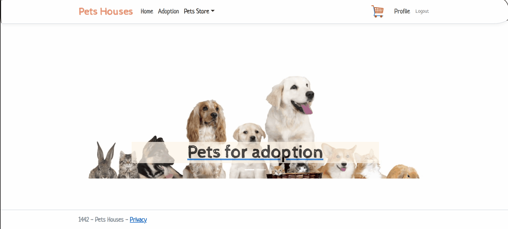
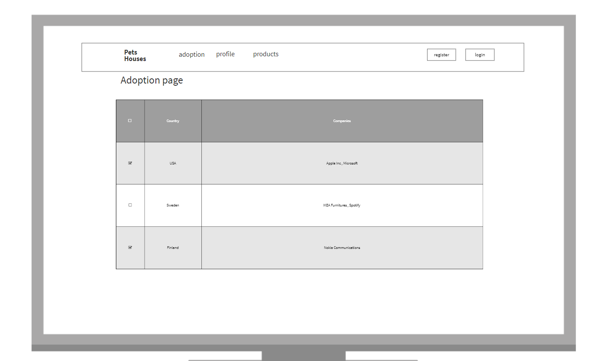
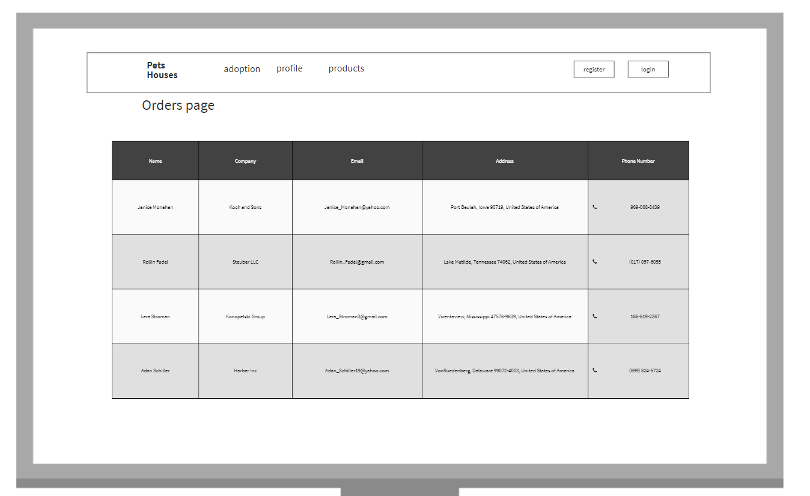
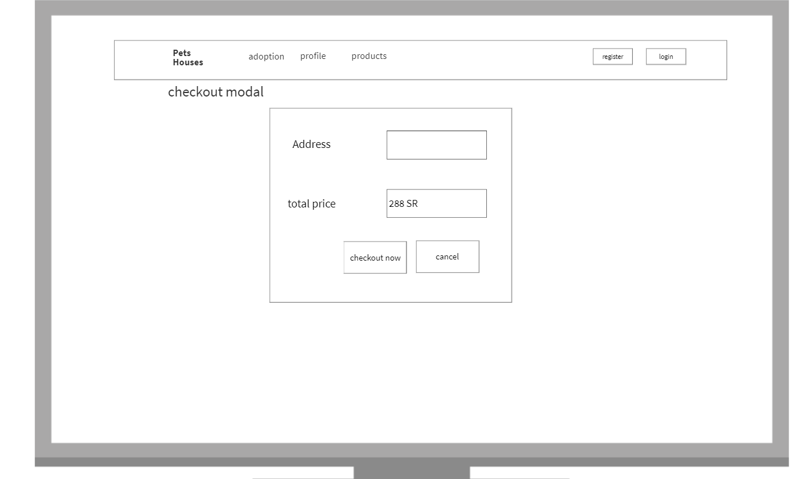
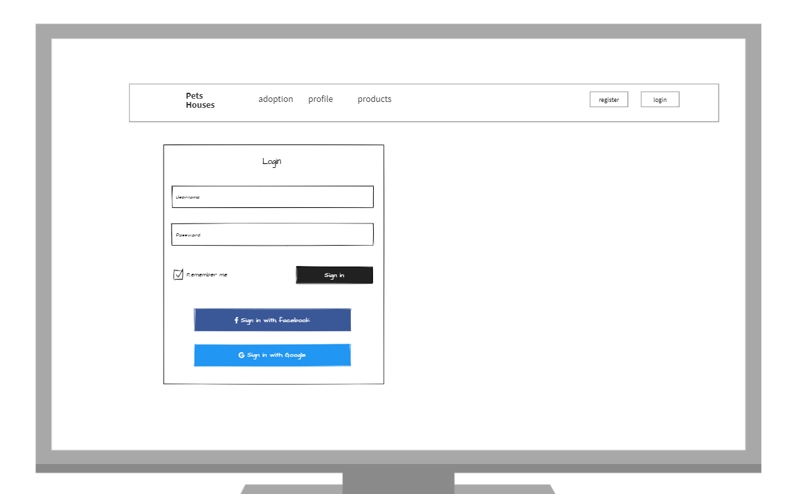
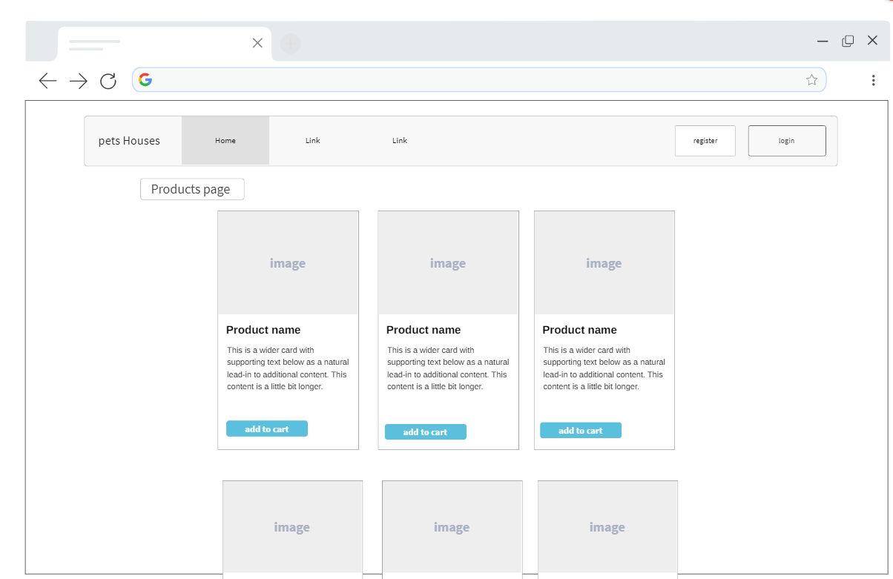
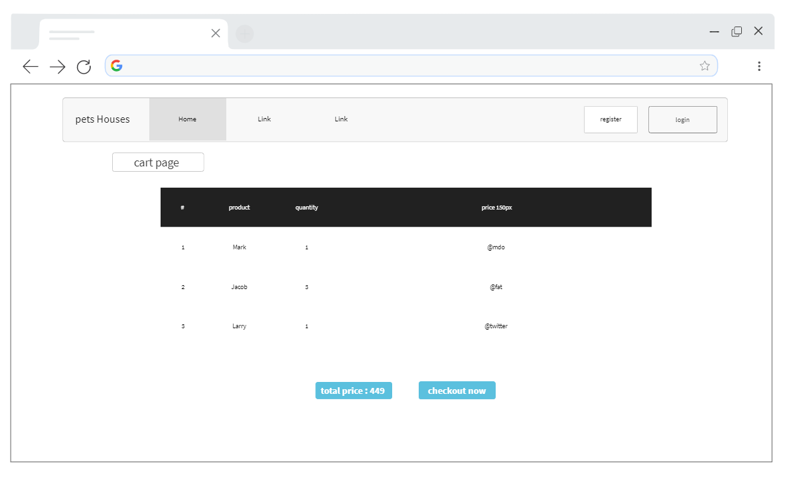

<div dir="rtl" align="right" >
  
  

  
  
----
# (App_Name) | اسم التطبيق
  Pets Houses
### المقدمــة | Introduction 
     We are useing the power of the Internet to connect adopters with shelter pets and help pets go from alone to adopted. With small store.
 
### Demo  
 
   

### wireframes










### Prerequisites
- NET 5 
- ASP.NET MVC
- Microsoft SQL Server 
### Set up  
 #### Database
 ``` dotnet ef database update```
### Front-End  
 - HTML
 - CSS
 - JS
 - Jquery
 - Bootstrap 
### Back-End 
 - ASP.NET MVC
 - MSSQL Server
 - EF Core
### By
 Taghreed alqahtani. 
 
 group : neom.

</div>
