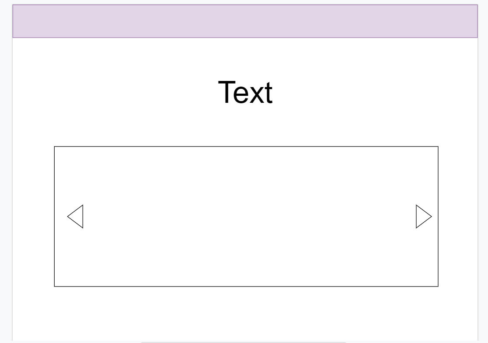
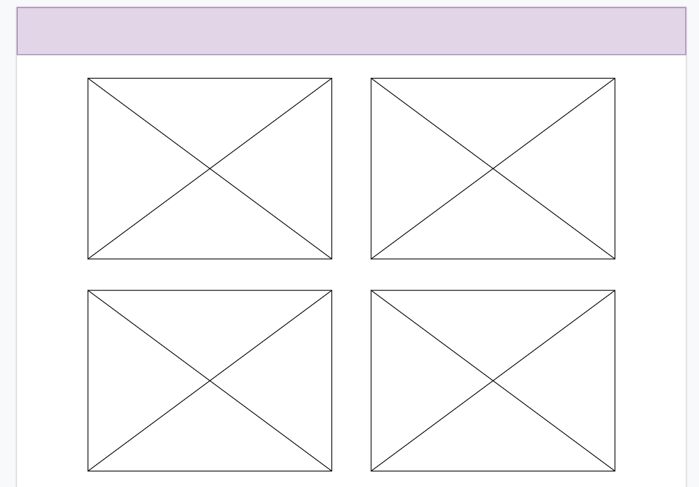

# Project04_Auth_CRUD_ASP.NET
<div dir="rtl" align="right" >


# Rental places 


## المقدمــة | Introduction 
 
 موقع  يوفر أماكن تأجير للمستخدمين ليضيفها أصحابها ويسمح لجميع المستخدمين بالتعبير عن رغباتهم من أجل توفيرها 


 A website that offers rental places for users to be added by their owners and allows all users to communicate their desires in order to be provided

## Demo  


<hr/>

## Wireframe

 
 
 

### Set up  

### Prerequisites
- NET 5 
- ASP.NET MVC
- Microsoft SQL Server 
### Set up  
 #### Database
 ``` dotnet ef database update```
### Front-End  
 - HTML
 - CSS
 - JS
 - Jquery
 - Bootstrap 
### Back-End 
 - ASP.NET MVC
 - MSSQL Server
 - EF Core
## Author : محمد الحربي


</div>