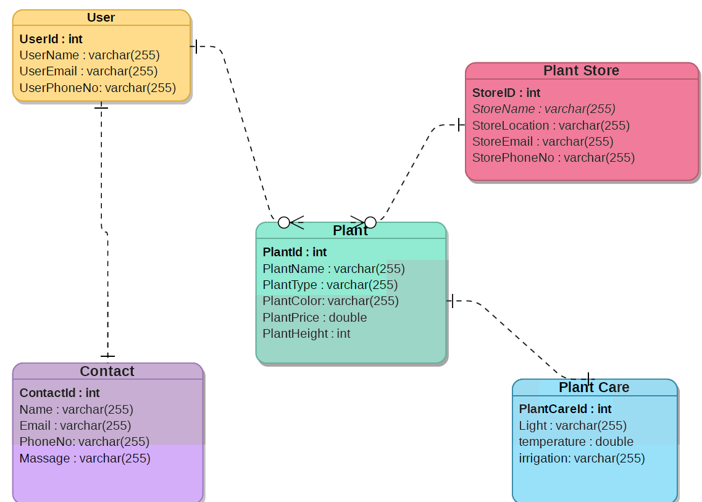
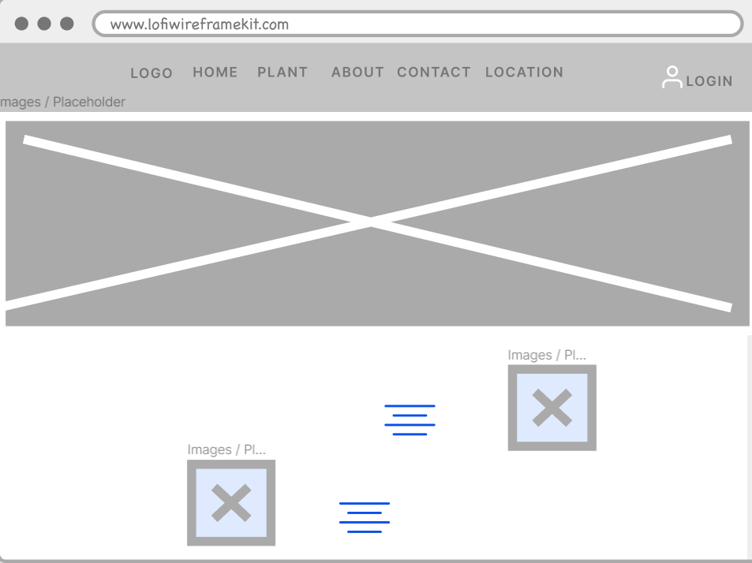
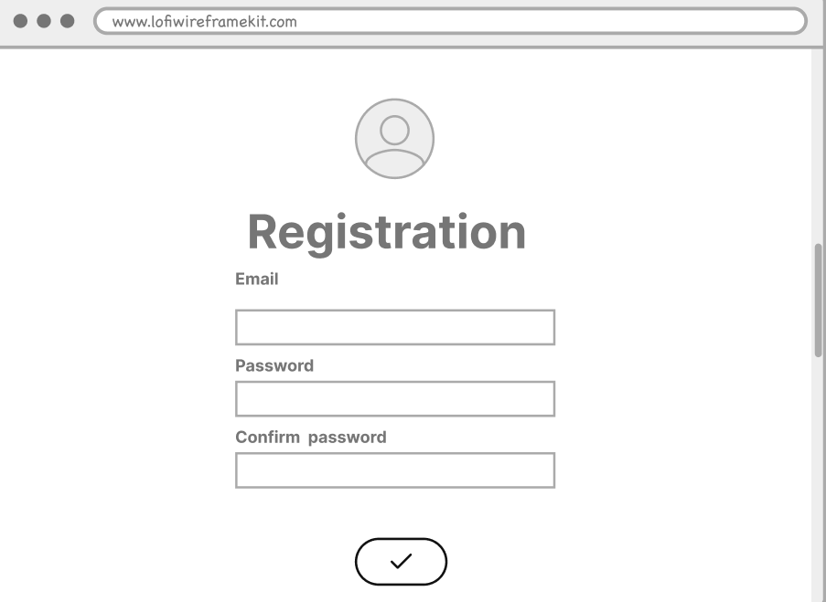
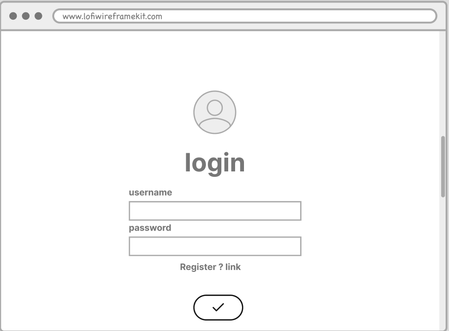
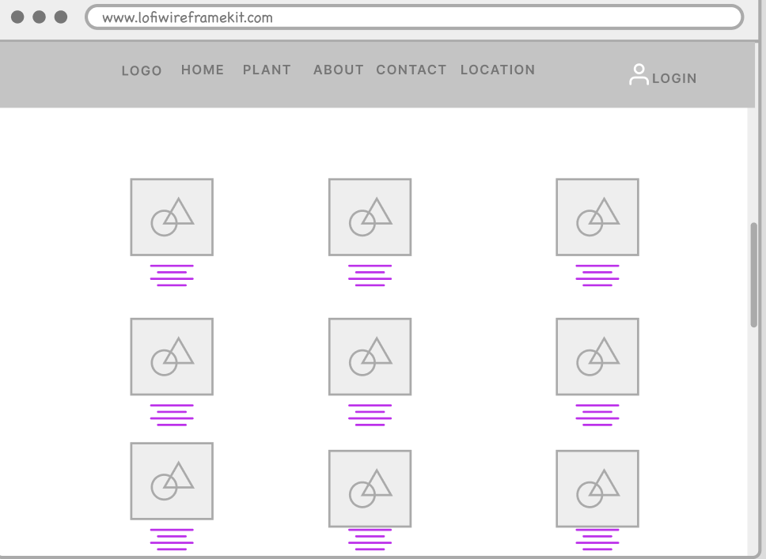
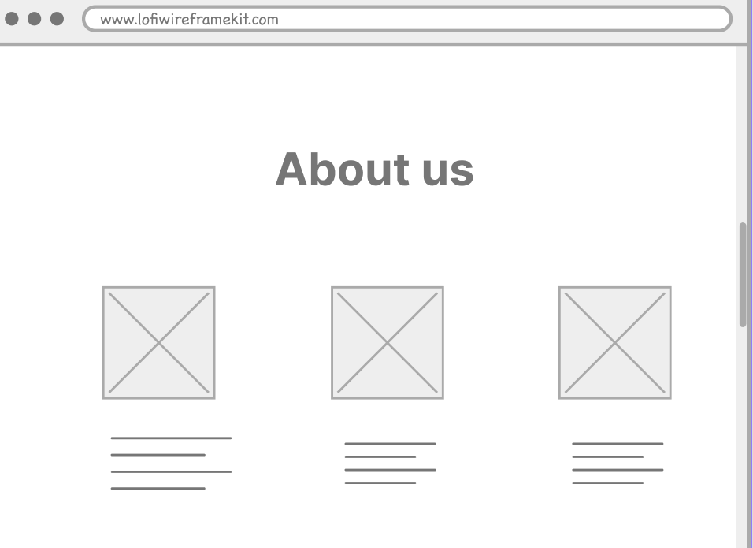
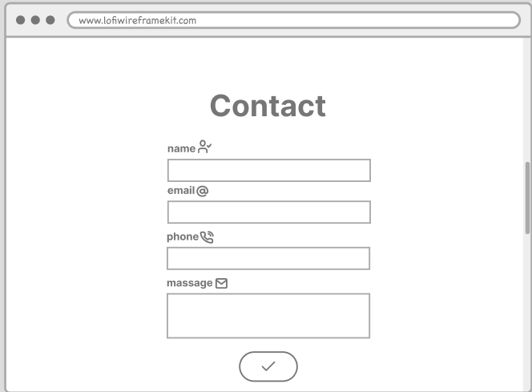
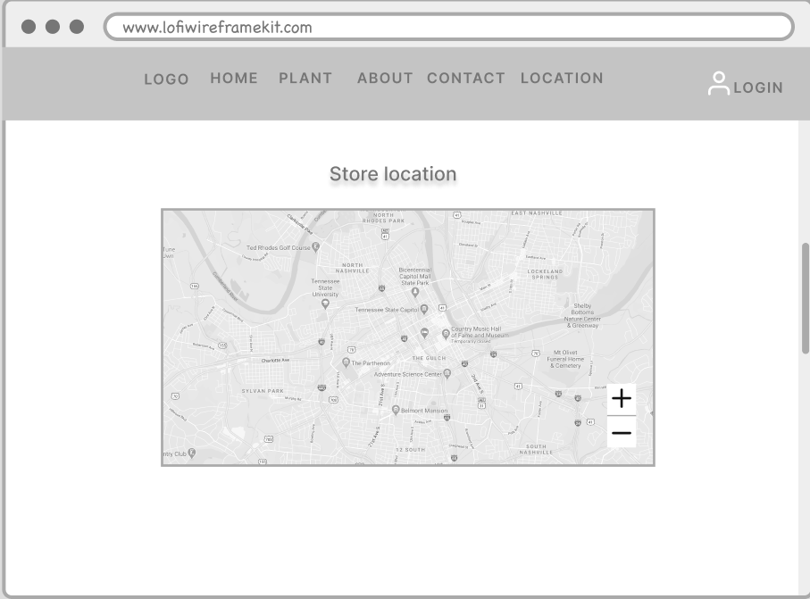

<div dir="rtl" align="right" >

 <div dir="ltr" align="center">


</div>

# (Plant Store) | (متجر نباتات )اسم التطبيق

### المقدمــة | Introduction 
فكرة المشروع  متجر نباتات حيث يعرض مجموعة من أنواع النباتات المختلفة ، ويمكن تطبيق عمليات  CRUD سواء 
بالحذف او التعديل او عرض تفاصيل النبتة ، تم إستخدام Create في التواصل مع المتجر من خلال اسم المستخدم وبريد الإلكتروني حيث ينشئ رسالة جديدة وتحفظ في قاعدة البيانات .

</div>

### ERD
 > ERD 


### Demo  
 


https://user-images.githubusercontent.com/82478321/122554323-7fc4fd00-d041-11eb-9b99-c3dc5c5f34b8.mp4


### Wireframe  

 <div dir="ltr" align="center">


> Home page 

>Registration page 

>login page 

>Plant page

>About page

>Contact page 

>Location page


  </div>

### Set up  
### Prerequisites
- NET 5 
- ASP.NET MVC
- Microsoft SQL Server 
### Set up  
 #### Database
 ``` dotnet ef database update```
### Front-End  
 - HTML
 - CSS
 - JS
 - Bootstrap 
### Back-End 
 - ASP.NET MVC
 - MSSQL Server
 - EF Core

 ### How to Clone Project 
 in command line 

```
git clone https://github.com/TaifBinEid/Project04_Auth_CRUD_ASP.NET
```
```
cd  Project04_Auth_CRUD_ASP.NETProject04_Auth_CRUD_ASP.NET
```
### Author
Taif Bin Eid
### License & Resource
All rights reserved to Tuwaiq Programming Bootcamp
</div>
