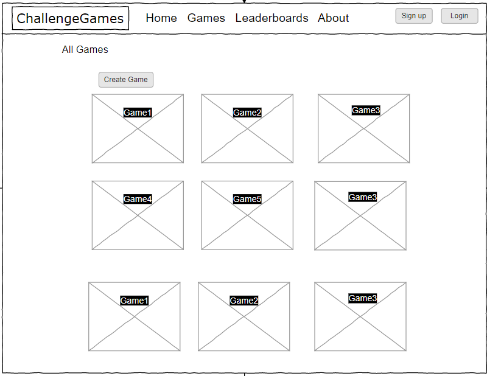
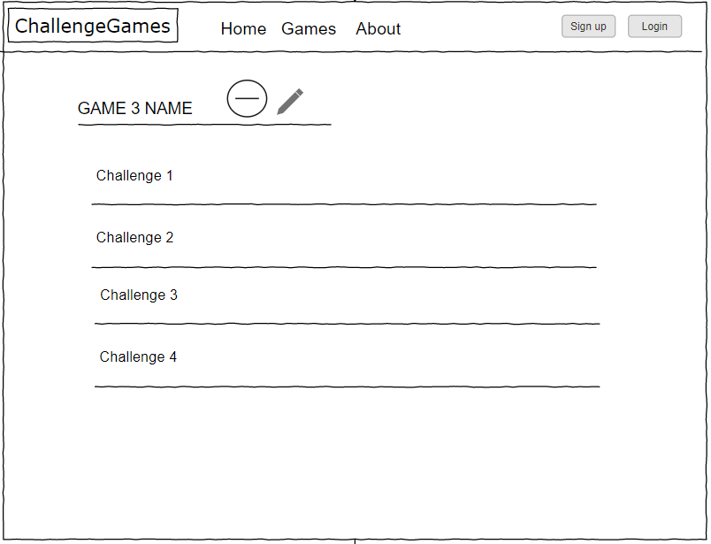
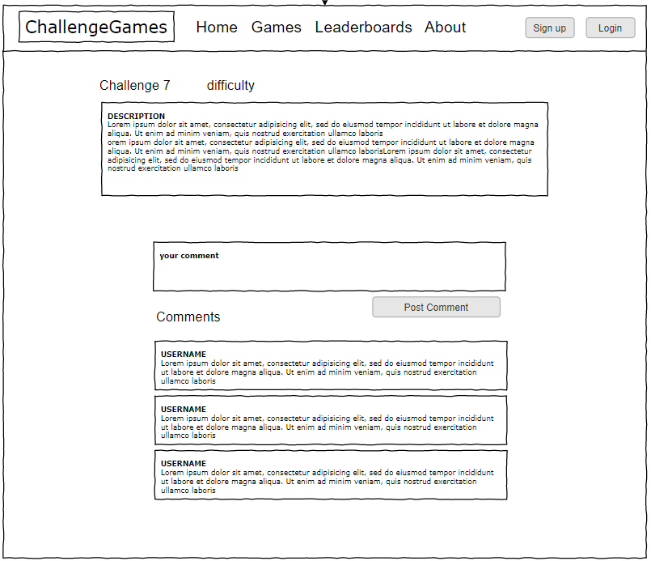
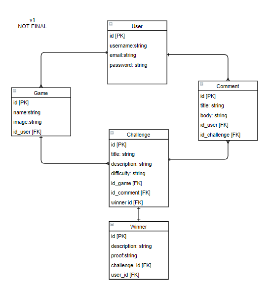
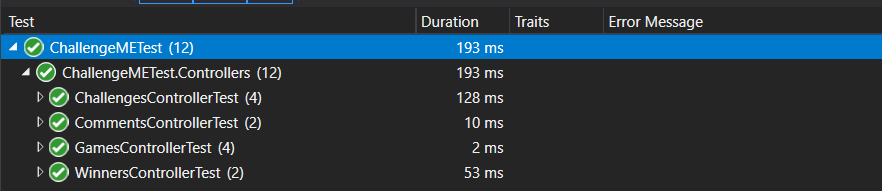

<div dir="ltr" align="center">


</div>

<hr />

<div dir="rtl" align="right" >

# ChallengeME

### المقدمــة | Introduction 
This project is all about challenges, users can register and login, and can see the list of available games. You can use the search bar to search for the game you're interested in to see the list of challenges related to that game. You can then comment on that challenge to share your thoughts or even submit a Youtube Link video of you completing that challenge. There is also a wins count for each user to see how many challenges they've won so far.
<br />
يدور هذا المشروع حول التحديات، حيث يمكن للمستخدمين التسجيل او تسجيل الدخول، ويمكنهم رؤية قائمة الألعاب المتاحة. يمكنك استخدام شريط البحث للبحث عن اللعبة التي تهتم بها للاطلاع على قائمة التحديات المتعلقة بتلك اللعبة. يمكنك بعد ذلك التعليق على هذا التحدي لمشاركة أفكارك أو حتى إرسال مقطع فيديو على Youtube Link لك وانت تكمل هذا التحدي. هناك أيضًا عدد مرات الفوز لكل مستخدم لمعرفة عدد التحديات التي فازوا بها حتى الآن..


</div>


<br />

## Demo  

### DEMO 1

 

### DEMO 2

 

<br />
<br />

## Wireframe  
هذه بعض الWireframes التي تم إنشائها قبل عملية التطوير للموقع.
 <br />


 - ### للصفحة الرئيسية (عرض الالعاب): 

 
 
 <br />

 - ### لصفحة معلومات اللعبة + التحديات الموجودة فيها:

 

 <br />

 - ### لصفحة معلومات التحدي: 

 

### ERD 

 


# Technologies Used | التقنيات المستخدمة

### Front-End  
 - HTML
 - CSS
 - JavaScript
 - Jquery
 - Bootstrap
 - Razoe Pages
 - Google Fonts

### Back-End 
 - ASP.NET MVC
 - MSSQL Server
 - EF Core
 - ASP.NET Identity

<br />

## Set up  

### Prerequisites
- NET 5
- ASP.NET MVC
- Microsoft SQL Server

## Set up
 #### Database
 ``` dotnet ef database update```


<br />
<br />

## Unit Testing:
Unit testing has been done to this project using NUnit. Also using `inmemorydatabse` to generate a database so we can pass to controllers. the testing was done on 4 different controllers. Here are the results of the tests done:




<br />

## Future updates and  iterations | التحديثات المستقبلية

- **Homepage:**
	- Better visuals overall for the hompage to show website's best features.
	- A section to show our top players that won the most challenges.
- **Submissions:**
	- Introduce a seprate section for submission on a challenge apart from comments.
- **Login/Register:**
	- A better  UI for loggin in and registering. 
	- Having the option to choose username and display it in the page. 
- **Overall better User Interface.**


<hr />

## Author:

### <b> اسم الطالب:</b>  محمد راشد البلوي.
### <b> المجموعة: </b>  القدية.
### <b> مشرفة المجموعة:</b>  نورة عبدالله.


## Resources:
- [ASP.NET Identity](https://docs.microsoft.com/en-us/aspnet/identity/overview/getting-started/introduction-to-aspnet-identity)
- [FontAwesome](https://fontawesome.com/v5.15/icons?d=gallery&p=2)
- [LINQ Query Operations](https://docs.microsoft.com/en-us/dotnet/csharp/programming-guide/concepts/linq/basic-linq-query-operations)
- [Bootstrap](https://getbootstrap.com/)
- [Bootstrap Cards](https://getbootstrap.com/docs/5.0/components/card/)


