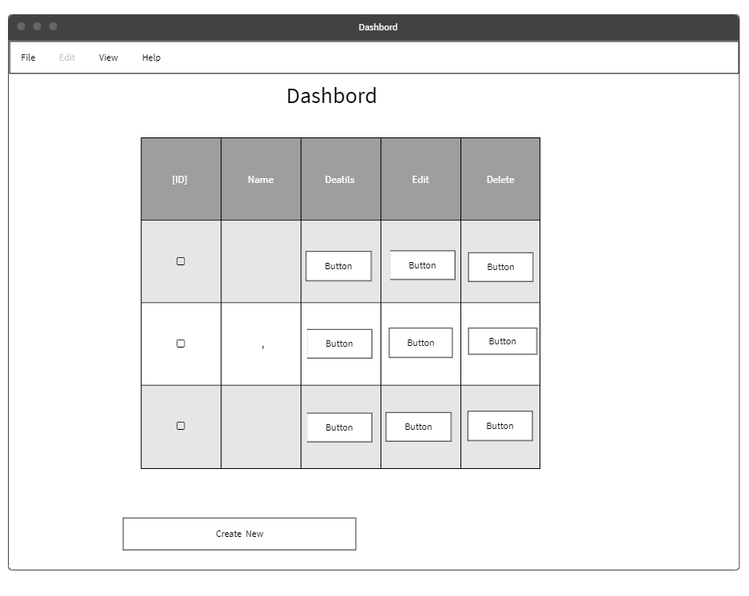

<div dir="rtl" align="Center" >
<<<<<<< HEAD
![Tuwaiq] (https://i.ibb.co/SV2BSn5/tuwaiq.png)
=======
[Tuwaiq] (https://i.ibb.co/SV2BSn5/tuwaiq.png)
  
>>>>>>> 577bec212abdbb9274d2ec5294f82a13bc3994d5
----
#  <div dir="rtl" align="Center" > اسم التطبيق | (TechME Dashbord)  </div>
  .......
### المقدمــة | Introduction 
  فكرة هذا الموقع عبارة عن لوحة تحكم يقوم بادارتها مدير النظام من خلال حذف واضافة وتعديل المعلومات على  الجداول  .
 ......
### Demo
 wirefram..
https://techmedashboard.azurewebsites.net/  
 .....
### Wireframe  
 ...
  wirefram..
  wirefram..
  wirefram..
   ER Diagram  .. 
 

### Set up  
### Prerequisites
- NET 5 
- ASP.NET MVC
- Microsoft SQL Server 
### Set up  
 #### Database
 ``` dotnet ef database update```
### Front-End  
 - HTML
 - CSS
 - JS
 - Jquery
 - Bootstrap 
### Back-End 
 - ASP.NET MVC
 - MSSQL Server
 - EF Core
### Author
 
رهف القحطاني 
### License & Resource
 .....
</div>
