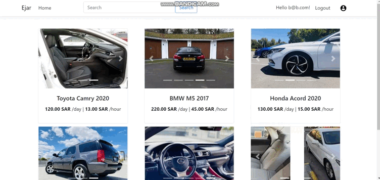
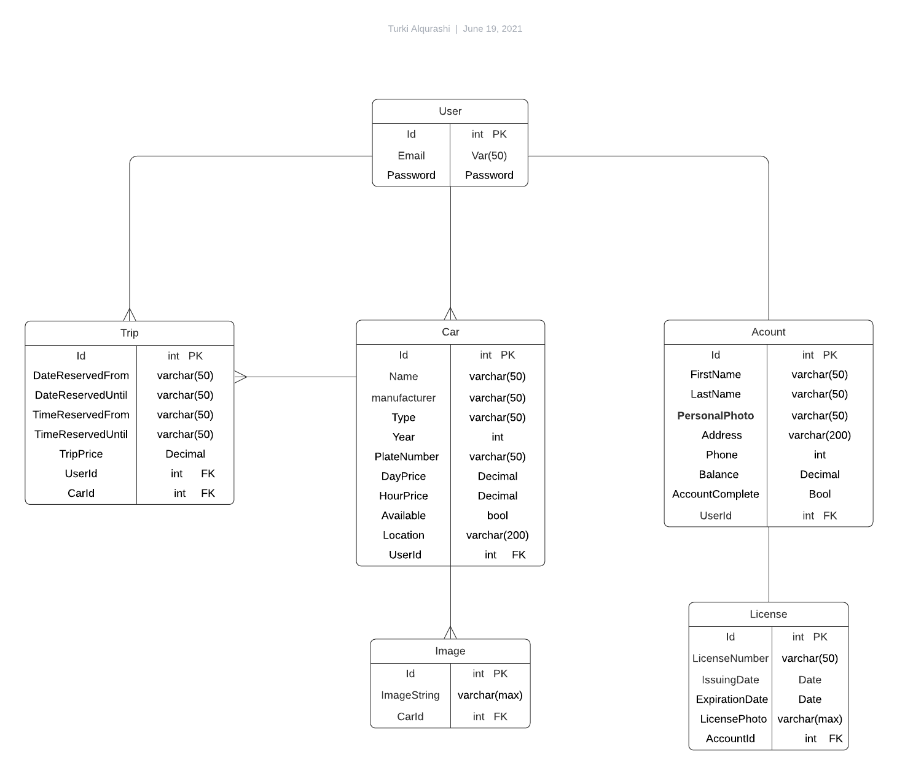

<div dir="rtl" align="right" >

----
  <br />

# (App_Name) | اسم التطبيق
  Ejar

### المقدمــة | Introduction
  <br/>
 تطبيق إيجار يسمح للمستخدم بعرض سيارته الني يرغب في تأجيرها على مستخدمين آخرين بالسعر الذي يقوم بتحديده. التطبيق أيضا يسمح للمستخدم بإستئجار سيارات مستخدمين آخرين بأسعار منافسة للسوق
 <br/>
 <br/>

### Demo  
 
  <br/>
  <br/>
  

 <br/>
  <br/>
  <br/>
  <br/>

### ERD  

<br/>
<br/>

### Wireframe  
  
  <br/>
  <br/>

### Set up  
### Prerequisites
- NET 5 
- ASP.NET MVC
- Microsoft SQL Server 
### Set up  
 #### Database
 ``` dotnet ef database update```

### Front-End  (Razor Pages)
 - HTML
 - CSS
 - JS
 - Bootstrap 
  <br/>
 the same project with react as front end can be found here:
https://github.com/Turkiajq/FinalProject.git

### Back-End 
 - ASP.NET MVC
 - MSSQL Server
 - EF Core
 - Unit Test
 
### Author
 Turki Alqurashi
### License & Resource
- Icons - Google Fonts
- ASP.NET Identity - www.c-sharpcorner.com
- Draw.Io
- Lusid Charts

</div>
