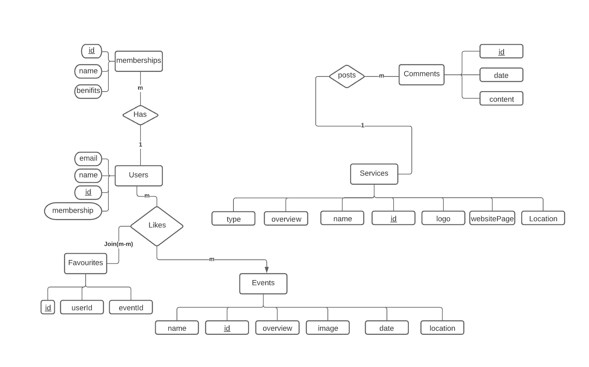

----
# Healthy Choice | الاختيار الصحي

### المقدمــة | Introduction 
شهدت الرياضة السعودية في الآونة الأخيرة مرحلة جديدة من صناعة التميز وزيادة الفعاليات وإطلاق المبادرات بما يحقق تنمية شاملة للقطاع الرياضي في المملكة ومن هذا المنطلق انطلقت هذه المنصة التي تضم النوادي والمطاعم الصحية والمتاجر الرياضية لمدينة الرياض مما يسهل على الفرد الوصول لهذه الخدمات بشكل أسرع وأيضا الاطلاع على التقييمات الخاصة بكل خدمة، بحيث توفر المنصة لمستخدميها عضويات تقدم لهم خصومات بالاعتماد على نوع العضوية، بالاضافة الى ميزة متابعة الاحداث والفعاليات الرياضية وإمكانية تفضيلها ليتم الرجوع إليها سواء بالحضور أو المشاركة

الفكرة قابلة للتطوير مستقبلا بحيث تضم جوانب تفاعلية بين المستخدمين الذين يشتركون في نفس الأهداف رغبة في الوصول الى مجتمع صحي ..
نسعد بأي اقتراحات تطويرية.

### Demo

 

### Deployment

<a href="https://healthchoiceproj420210619005719.azurewebsites.net/" rel="nofollow">HealthyCoice</a>, deployed to Azure

### Wireframe  

You can view application wireframe <a href="https://wireframe.cc/pro/pp/08719377d451892" rel="nofollow">here</a>
 

### ERD

## Set up  

### Prerequisites
- NET 5 
- ASP.NET MVC
- Microsoft SQL Server 

## Built With

### Front-End  
 - HTML
 - CSS
 - Bootstrap 
 - Materializecss
### Back-End 
 - ASP.NET MVC
 - MSSQL Server
 - EF Core
### Author

<b>Samirah Alhusayni

