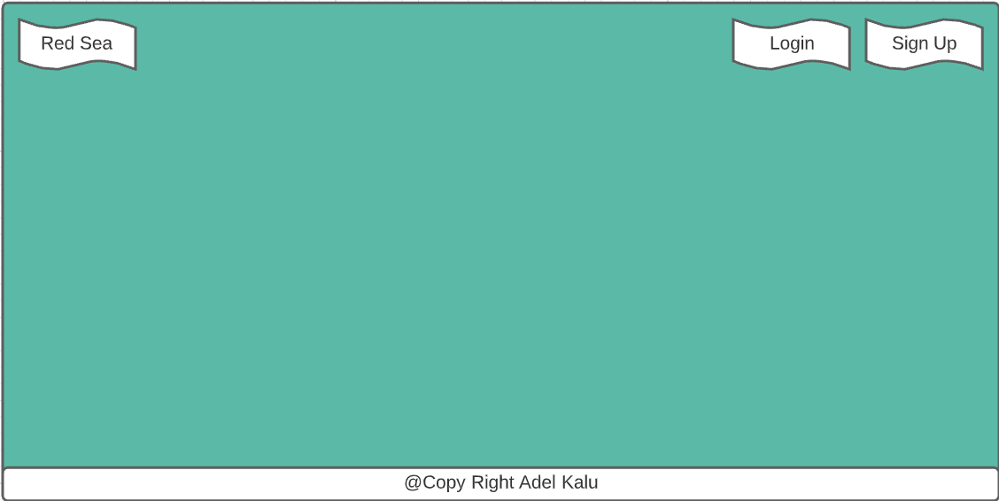
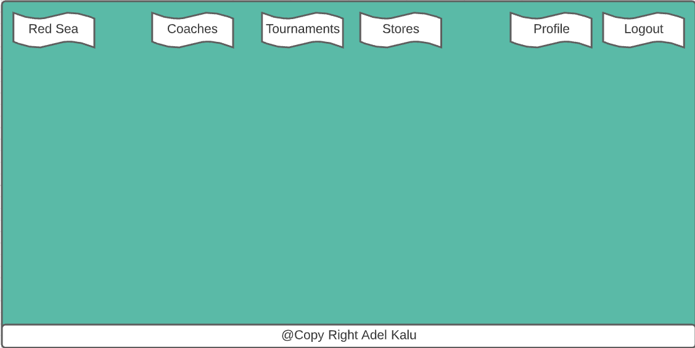
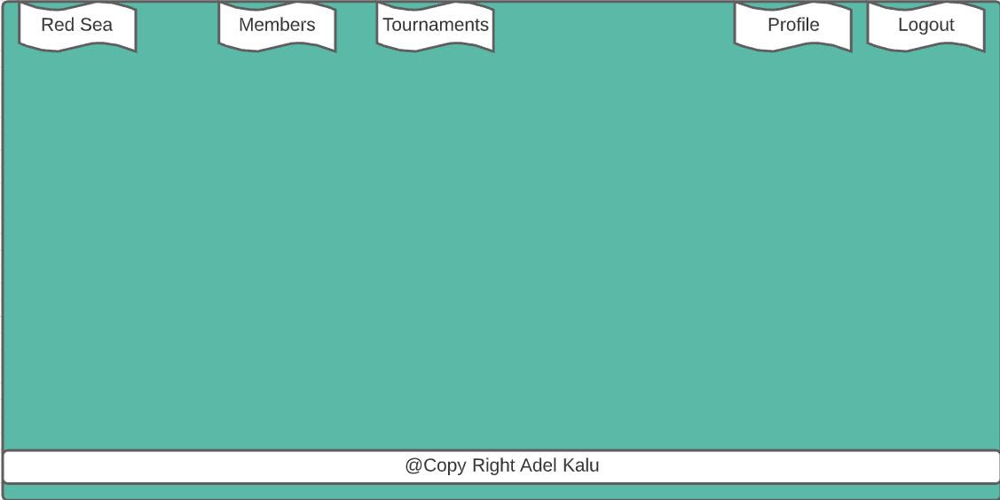
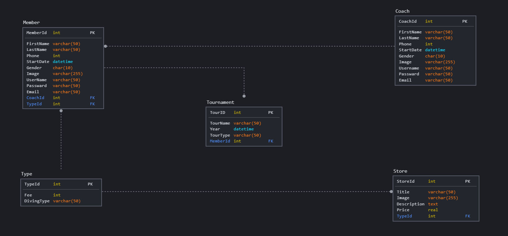
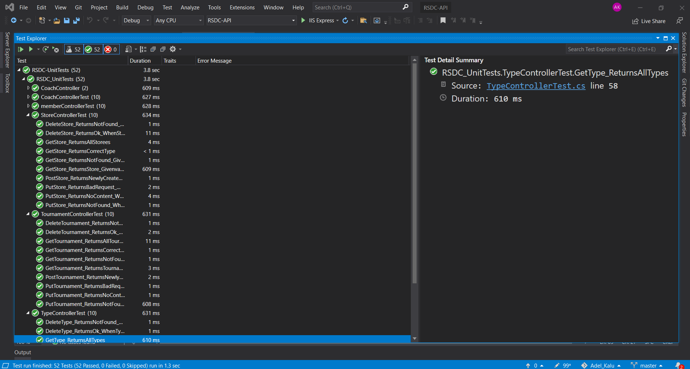
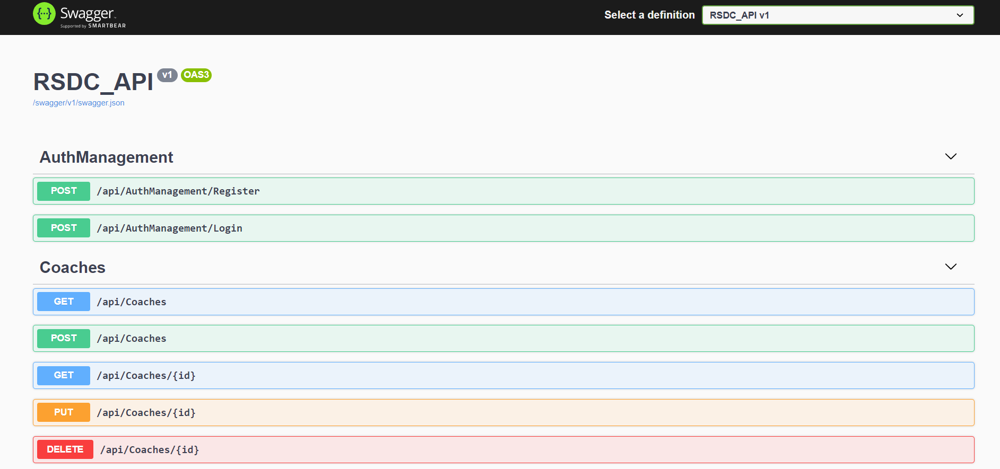
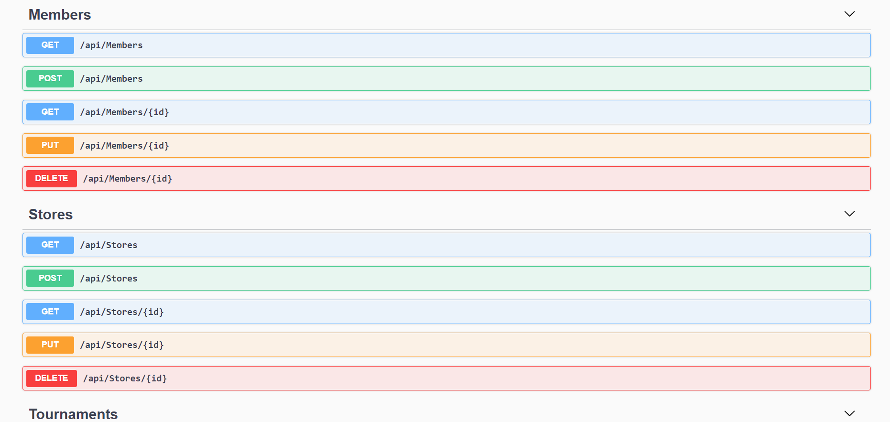
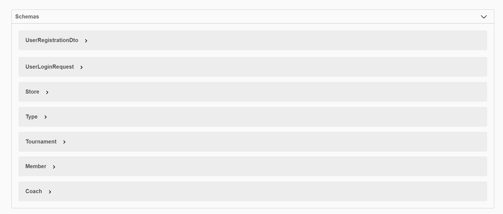

# Project04_Auth_CRUD_ASP.NET


# مركز البحر الأحمر للغوص

## المقدمــة
مرز البحر الأحمر للغوص للتدريب ولبيع جميع أدوات الغوص
- الاشتراك في المركز للمدرب والمتدرب 
- الاشتراك في المسابقات
- بيع أدوات الغوص


### Demo  
[](https://youtu.be/yzeIFIsOHKE)

 ## Important Links

- [Deployed API](https://rsdc-api.azurewebsites.net)
- [Deployed Client](https://adelkalu.github.io/RSDC-React/)

### Catalog of Routes

#### User:
Verb         |	URI Pattern  | Description
------------ | ------------- |-------------
POST   | https://localhost:44344/api/register | Sign up
POST   | https://localhost:44344/api/login | Login

#### Members:
Verb         |	URI Pattern  | Description
------------ | ------------- |-------------
POST   | https://localhost:44344/api/members    | Add new
GET    | https://localhost:44344/api/members    | Get all  
GET    | https://localhost:44344/api/members/id | Get specific  
PUT    | https://localhost:44344/api/members/id | Edit 
DELETE | https://localhost:44344/api/members/id | Delete 

#### Coaches:
Verb         |  URI Pattern  | Description
------------ | ------------- |-------------
POST   | https://localhost:44344/api/coaches    | Add new
GET    | https://localhost:44344/api/coaches    | Get all  
GET    | https://localhost:44344/api/coaches/id | Get specific  
PUT    | https://localhost:44344/api/coaches/id | Edit 
DELETE | https://localhost:44344/api/coaches/id | Delete 

#### Types:
Verb         |  URI Pattern  | Description
------------ | ------------- |-------------
POST   | https://localhost:44344/api/types    | Add new
GET    | https://localhost:44344/api/types    | Get all  
GET    | https://localhost:44344/api/types/id | Get specific  
PUT    | https://localhost:44344/api/types/id | Edit 
DELETE | https://localhost:44344/api/types/id | Delete 

#### Story:
Verb         |  URI Pattern  | Description
------------ | ------------- |-------------
POST   | https://localhost:44344/api/stores    | Add new
GET    | https://localhost:44344/api/stores    | Get all  
GET    | https://localhost:44344/api/stores/id | Get specific  
PUT    | https://localhost:44344/api/stores/id | Edit 
DELETE | https://localhost:44344/api/stores/id | Delete 

#### Tournaments:
Verb         |  URI Pattern  | Description
------------ | ------------- |-------------
POST   | https://localhost:44344/api/tournaments    | Add new
GET    | https://localhost:44344/api/tournaments    | Get all  
GET    | https://localhost:44344/api/tournaments/id | Get specific  
PUT    | https://localhost:44344/api/tournaments/id | Edit 
DELETE | https://localhost:44344/api/tournaments/id | Delete 

### Wireframe  




### ERD  


### Unit Test
CRUD working test with database



### Swagger





### Set up  
### Prerequisites
- NET 5 
- ASP.NET MVC
- Microsoft SQL Server 

### Set up  
 #### Database
 ``` dotnet ef database update```

### Front-End-React
#### Set up and Installation instructions
You need to add these command in react app:
1. React Router DOM:
  ```
   npm install react-router-dom 
   ```
 Add this import in the js file you use it:
  ```
 import {BrowserRouter as Router, Route, Link} from 'react-router-dom';
```

2. Axios:
  ```
  npm install axios
  ```
 Add this import in the js file you use it:
  ```
import axios from 'axios';
  ```

3. jsonwebtoken:
  ```
  npm install jsonwebtoken
  ```
 Add this import in the js file you use it:
  ```
import { decode } from "jsonwebtoken";
  ```

4. React-Bootstrap:
  ```
  npm install react-bootstrap bootstrap
  ```
 Add this import in the index.js:
  ```
 import 'bootstrap/dist/css/bootstrap.min.css';
  ```
 
### Back-End  
 - ASP.NET MVC
 - MSSQL Server
 - EF Core
 - Type my authentication
- JWT
 - Unit Test

### Author
Adel Kalu
### License & Resource
[Asp.Net Core 5 Rest API Step by Step](https://dev.to/moe23/asp-net-core-5-rest-api-step-by-step-2mb6)

[Asp Net Core 5 Rest API Authentication with JWT Step by Step](https://dev.to/moe23/asp-net-core-5-rest-api-authentication-with-jwt-step-by-step-140d)

[Unit Test](https://www.youtube.com/watch?v=ddrR440JtiA&list=LL)
