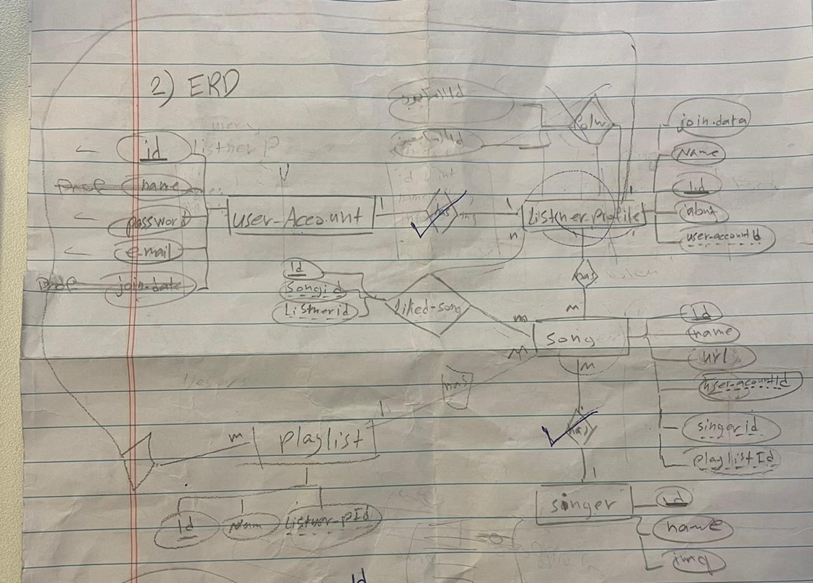
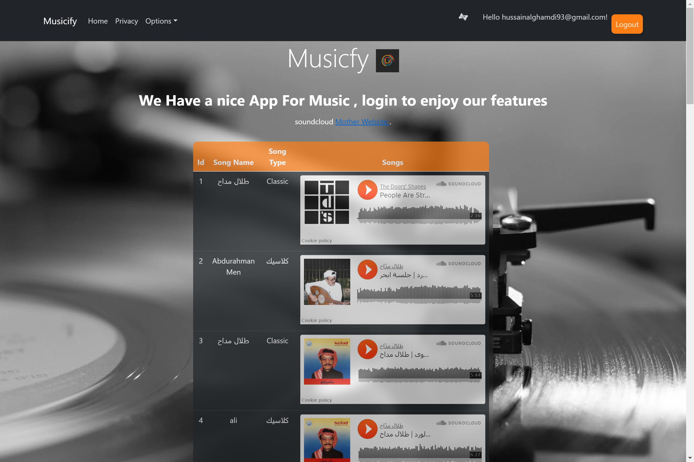
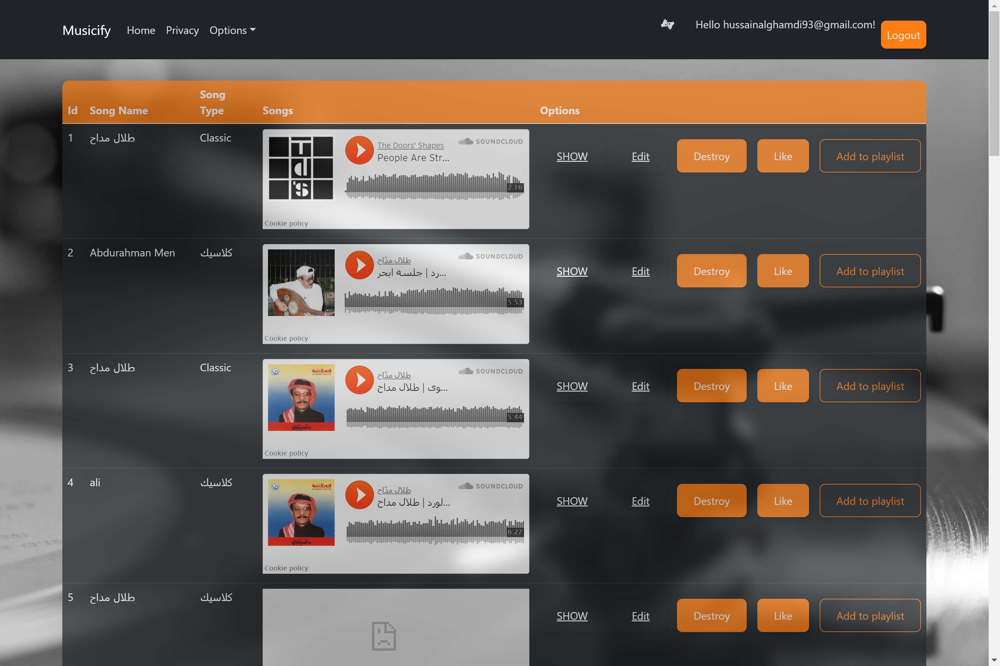

# Project04_Auth_CRUD_ASP.NET

<div dir="rtl" align="right">

فكرة المشروع

بناء مشروع متكامل باستخدام ASP.NET MVC  قائم على فكرة من اختيارك وتتضمن المتطلبات الأساسية لبناء تطبيق ASP.NET MVC مع  Entity Framework Core وSql Server.


قبل بداية المشروع 

عمل Wireframes و ERD والتأكيد مع أحد المدربين قبل البدء بتنفيذ المشروع. بداية المشروع بالنسخة رقم  v.1

متطلبات المشروع


- استخدام نمط MVC 
- إنشاء على الأقل 4 من Controllers
- إنشاء على الأقل 4 Model 
- إنشاء على الأقل 6 Views
    - استخدام مكتبة Bootstrap مع Razor 
    - استخدام partial view للعناصر المتكررة في الواجهات
- استخدام وظائف CRUD مع ASP.NET 
- استخدام إطار عمل Entity Framework Core
- استخدام CodeFirst Approach لإنشاء قاعدة البيانات
- استخدام قاعدة بيانات MSSQL 
    - ان تكون قاعدة البيانات متعددة الجداول
    - يجب ان تتضمن قاعدة البيانات على الاقل احد العلاقات التالية:
        - علاقة one-to-one
        - علاقة one-to-many
        - علاقة many-to-many
- تطبيق Authentication 
- قم بتطبيق Unit Testing على مشروعك
    


إضافة | Bonus 
- قم باستخدام أحد مفاهيم Design Patterns في مشروعك لحل مشكلةٍ ما
- إنشاء APIs 
- عمل Deploy للمشروع على Azure
- استخدام React مع ASP.NET أو أي Framework 
- استخدام WebSockets في ASP.NET core
- التعامل مع الـThird party APIs  {SMS Message, Google Maps,….} 
    - مصادر للـAPIs
    - الاول: Any API over 1400 Public APIs: https://any-api.com/
    - الثاني: API Search: http://apis.io/
- رفع صور او ملفات 
    -  باستخدام الـthird-party:
        - Cloudinary: https://cloudinary.com/
        -  AWS: https://aws.amazon.com/s3/?nc2=h_ql_prod_st_s3
    - حفظها  بالـLocal server 
</div>

<div dir="rtl" align="right" >

----
# (App_Name) | اسم التطبيق
 Musicfy | ميوزك فاي
### المقدمــة | Introduction 
بسم الله الرحمن الرحيم 
ميزيك فاي هو موقع يجمع كل الأغاني الموجوده حلو العالم و يقدمها في قالب جيد و سهل للمستخدم بكل بساطه هو موقع ينافس جميع مواقع الأغاني لكثرة الخدمات المقدمة فيه 
### Demo  
[Demo_Musicfy_Part](https://drive.google.com/file/d/15qwgUVhgIZZt9-Xho_FlWJit-pusa9OL/view?usp=sharing)


[Demo_Musicfy](https://drive.google.com/file/d/1b1SFnc0_aqHBgclNSVnQC36zg4EWeDKh/view?usp=sharing)
### Wireframe  
بدأ المشروع بهذا الشكل 
.
.


.
.
وانتهى على هذا الشكل بجميع المميزات



### Set up  
### Prerequisites
- NET 5 
- ASP.NET MVC
- Microsoft SQL Server 
### Set up  
 #### Database
 ``` dotnet ef database update```
### Front-End  
 - HTML
 - CSS
 - JS
 - Jquery
 - Bootstrap 
### Back-End 
 - ASP.NET MVC
 - MSSQL Server
 - EF Core
### Author
الاسم : حسين عبدالله الغامدي ، المشرفه : في العتيبي ، المجموعه : البحر الأحمر
### License & Resource
By uploading or posting Your Content to the Platform, you initiate an automated process to transcode any audio Content and direct SoundCloud to store Your Content on our servers, from where you may control and authorize the use, ways of reproduction, transmission, distribution, public display, public performance, making available (including whether users will be permitted to listen to your Content offline) and other communication to the public of Your Content on the Platform and elsewhere using the Services. To the extent it is necessary in order for SoundCloud to provide you with any of the aforementioned hosting services, to undertake any of the tasks set forth in these Terms of Use, including the distribution of advertising or other promotional material on our Platform and/or to enable your use of the Platform, you hereby grant such licenses to SoundCloud on a limited, worldwide, non-exclusive, royalty-free and fully paid basis.

By uploading Your Content to the Platform, you also grant a limited, worldwide, non-exclusive, royalty-free, fully paid up, license to other users of the Platform, and to operators and users of any other websites, apps and/or platforms to which Your Content has been shared or embedded using the Services ("Linked Services"), to use, copy, listen to offline, repost, transmit or otherwise distribute, publicly display, publicly perform, adapt, prepare derivative works of, compile, make available and otherwise communicate to the public, Your Content utilizing the features of the Platform from time to time, and within the parameters set by you using the Services. You can limit and restrict the availability of certain of Your Content to other users of the Platform, and to users of Linked Services, at any time using the permissions tab in the track edit section for each sound you upload, subject to the provisions of the Disclaimer section below. Notwithstanding the foregoing, nothing in these Terms of Use grants any rights to any other user of the Platform with respect to any proprietary name, logo, trademark or service mark uploaded by you as part of Your Content (for example, your profile picture) ("Marks"), other than the right to reproduce, publicly display, make available and otherwise communicate to the public those Marks, automatically and without alteration, as part of the act of reposting sounds with which you have associated those Marks.

The licenses granted in this section are granted separately with respect to each item of Your Content that you upload to the Platform. Licenses with respect to audio Content, and any images or text within your account, will (subject to the following paragraph of these Terms of Use) terminate automatically when you remove such Content from your account. Licenses with respect to comments or other contributions that you make on the Platform will be perpetual and irrevocable, and will continue notwithstanding any termination of your account.

Removal of audio Content from your account will automatically result in the deletion of the relevant files from SoundCloud’s systems and servers. However, notwithstanding the foregoing, you hereby acknowledge and agree that once Your Content is distributed to a Linked Service, SoundCloud is not obligated to ensure the deletion of Your Content from any servers or systems operated by the operators of any Linked Service, or to require that any user of the Platform or any Linked Service deletes any item of Your Content. Furthermore, if you authorize any of Your Content to be available for offline listening, after deletion of an item of Your Content or removal from the ability for other users to listen to the applicable Content offline, the applicable Content may still be temporarily available to other users of the Platform who saved the applicable Content for offline listening on their devices, but no longer than 30 days from the time of deletion.

Any Content other than Your Content is the property of the relevant Uploader, and is or may be subject to copyright, trademark rights or other intellectual property or proprietary rights. Such Content may not be downloaded, reproduced, distributed, transmitted, re-uploaded, republished, displayed, sold, licensed, made available or otherwise communicated to the public or exploited for any purposes except via the features of the Platform from time to time and within the parameters set by the Uploader on the Platform or with the express written consent of the Uploader. Where you repost another user’s Content, or include another user’s Content in a playlist or station or where you listen to another user’s Content offline, you acquire no ownership rights whatsoever in that Content. Subject to the rights expressly granted in this section, all rights in Content are reserved to the relevant Uploader.
</div>