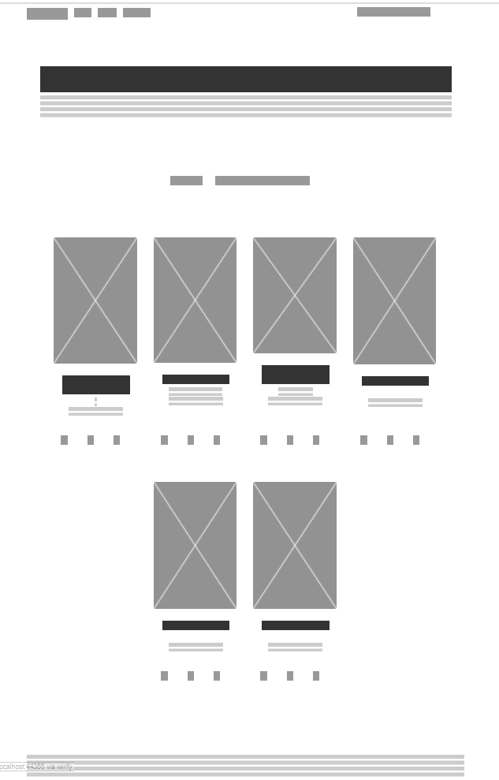
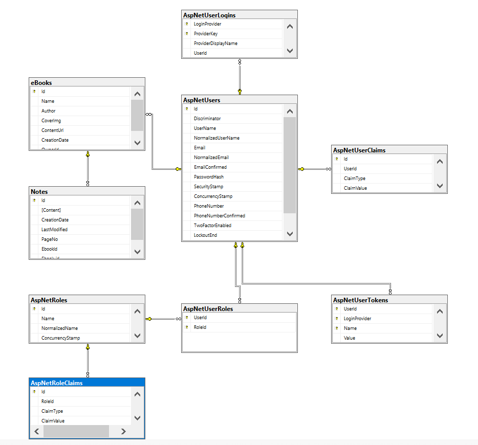

<div dir="rtl" align="right" >


# (E-Bookshelf) | اسم التطبيق  
### المقدمــة | Introduction   
 تطبيق ويب يقدم خدمات لإدارة الكتب الإلكترونية
 
 الخدمات المتوفرة حالياً
 1. رفع الكتب وحفظها في السحابة
 2. قارئ الكتب الإليكترونية
 3. تحميل الكتب
 4. تحويل أي صفحة ويب إلى كتاب إليكتروني, وتطبيق الخدمات السابقة عليه
 
 خدمات ستضاف قريباٌ
 
 1.  كتابة الملاحظات على الكتب

 , رفع الكتب وحفظها في
### Demo    


### Wireframe    
  

### ERD    
  

### Set up   
 
### Prerequisites  
- NET 5   
- ASP.NET MVC  
- Microsoft SQL Server
- aws account and s3 setup 
- pdfcrowd api valid licence

### Set up    
 #### Database  
 ``` dotnet ef database update```  
### Front-End    
 - HTML  
 - CSS  
 - JS  
 - Jquery  
 - Bootstrap
 - [Future Press Epub Reader](http://futurepress.org/)

### Back-End   
 - ASP.NET MVC  
 - MSSQL Server  
 - EF Core
 - Aspose.PDF
 - AWSSDK.S3
 - EpubSharp.dll
 - Pdfcrowd.Official
 
 ### Author  
 [Thamer Mashni](https://github.com/ThamerBootcamp)
</div>